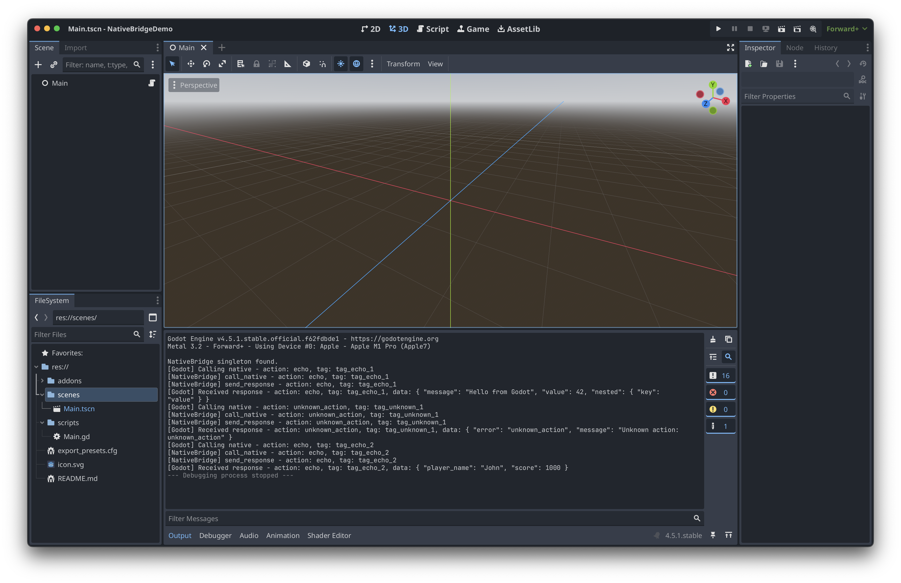

<p align="center">
    <a href="https://github.com/godot-x/native-bridge" target="_blank" rel="noopener noreferrer">
        
    </a>
</p>

# NativeBridge

NativeBridge is a lightweight, cross-platform plugin for **Godot** that provides a simple and unified interface to communicate between GDScript and native platform code. It uses a clean **action-based** API with automatic response tagging, making it easy to integrate native SDKs, analytics, in-app purchases, and custom platform features.

## Features

- **Simple Interface**: Call native code with `call_native(action, data, tag)` from GDScript
- **Cross-Platform**: Works on Desktop (C++), iOS (Objective-C++), and Android (Kotlin)
- **Action-Based**: Easy-to-extend architecture - just add a handler method for each action
- **Tag System**: Every call includes a tag that's returned in the response for easy tracking
- **Type-Safe**: Uses Godot's Dictionary type for data passing
- **Echo Action**: Built-in echo action for testing communication

## Installation

1. Copy the `addons/native_bridge` folder into your Godot project's `addons/` directory
2. Build the native libraries for your target platform(s) (see **Building** section below)
3. The plugin is automatically loaded as a GDExtension - no manual activation needed
4. Access it via the singleton: `Engine.get_singleton("NativeBridge")`

## Usage

### Basic Example

```gdscript
extends Node

var native_bridge: Object = null

func _ready() -> void:
    # Get the NativeBridge singleton
    if Engine.has_singleton("NativeBridge"):
        native_bridge = Engine.get_singleton("NativeBridge")

        # Connect to the response signal
        if native_bridge.has_signal("native_response"):
            native_bridge.connect("native_response", Callable(self, "_on_native_response"))

    # Call native code
    call_native("echo", {
        "message": "Hello from Godot!",
        "value": 42
    }, "my_tag")

func call_native(action: String, data: Dictionary = {}, tag: String = "") -> void:
    if native_bridge and native_bridge.has_method("call_native"):
        native_bridge.call("call_native", action, data, tag)

func _on_native_response(action: String, data: Dictionary, tag: String) -> void:
    print("Received: action=%s, tag=%s, data=%s" % [action, tag, str(data)])
```

### Interface

**From Godot to Native:**
```gdscript
call_native(action: String, data: Dictionary, tag: String)
```

**From Native to Godot:**
```gdscript
signal native_response(action: String, data: Dictionary, tag: String)
```

The `tag` parameter is always preserved - whatever tag you send is the same tag you receive in the response.

## Building

### Prerequisites

- **CMake** 3.20 or higher
- **C++17** compatible compiler
- **Make** (or use CMake directly)

### Desktop Platforms

Build the native libraries using the included Makefile:

```bash
# macOS
make build-macos

# Linux
make build-linux

# Windows
make build-windows

# Clean build files
make clean
```

The compiled libraries will be placed in `addons/native_bridge/bin/`:
- macOS: `libnative_bridge_macos.dylib`
- Linux: `libnative_bridge_linux.so`
- Windows: `native_bridge_windows.dll`

### iOS

iOS uses Objective-C++ implementation in `addons/native_bridge/ios/NativeBridgePlugin.mm`.

When exporting for iOS:
1. Make sure the file is included in your Xcode project
2. The C++ bridge automatically delegates to the iOS implementation
3. Build as usual through Godot's iOS export

### Android

Android uses Kotlin implementation in `addons/native_bridge/android/src/main/java/com/godotx/nativebridge/NativeBridgePlugin.kt`.

When exporting for Android:
1. Ensure the Kotlin plugin is properly configured in your Godot Android export
2. The plugin will be automatically registered
3. Build as usual through Godot's Android export

## Adding New Actions

The plugin currently implements only the **"echo"** action as a starting point. Here's how to add your own actions:

### 1. In C++ (Desktop)

Edit `addons/native_bridge/cpp/src/native_bridge.cpp`:

```cpp
// Add a new handler method
void NativeBridge::handle_my_action(const String &action, const Dictionary &data, const String &tag) {
    // Process the data
    String input = data.get("input", "default");

    // Prepare response
    Dictionary response_data;
    response_data["result"] = "Processed: " + input;

    // Send response back to Godot
    send_response(action, response_data, tag);
}
```

Update the header file `native_bridge.h`:

```cpp
private:
    void handle_echo(const String &action, const Dictionary &data, const String &tag);
    void handle_my_action(const String &action, const Dictionary &data, const String &tag);  // Add this
    void handle_unknown_action(const String &action, const Dictionary &data, const String &tag);
```

Update `call_native()` in `native_bridge.cpp`:

```cpp
void NativeBridge::call_native(const String &action, const Dictionary &data, const String &tag) {
    // ... iOS delegation code ...

    if (action == "echo") {
        handle_echo(action, data, tag);
    } else if (action == "my_action") {  // Add this
        handle_my_action(action, data, tag);
    } else {
        handle_unknown_action(action, data, tag);
    }
}
```

### 2. In iOS (Objective-C++)

Edit `addons/native_bridge/ios/NativeBridgePlugin.mm`:

```objc
- (void)callNative:(NSString *)action data:(NSString *)dataJson tag:(NSString *)tag {
    if ([action isEqualToString:@"echo"]) {
        [self handleEcho:action data:dataJson tag:tag];
    } else if ([action isEqualToString:@"my_action"]) {  // Add this
        [self handleMyAction:action data:dataJson tag:tag];
    } else {
        [self handleUnknownAction:action data:dataJson tag:tag];
    }
}

- (void)handleMyAction:(NSString *)action data:(NSString *)dataJson tag:(NSString *)tag {
    // Parse incoming JSON, process, and create response
    NSDictionary *responseDict = @{
        @"result": @"Processed on iOS"
    };
    NSData *jsonData = [NSJSONSerialization dataWithJSONObject:responseDict options:0 error:nil];
    NSString *responseJson = [[NSString alloc] initWithData:jsonData encoding:NSUTF8StringEncoding];
    [self sendResponse:action data:responseJson tag:tag];
}
```

### 3. In Android (Kotlin)

Edit `addons/native_bridge/android/src/main/java/com/godotx/nativebridge/NativeBridgePlugin.kt`:

```kotlin
fun callNative(action: String, data: Dictionary, tag: String) {
    when (action) {
        "echo" -> handleEcho(action, data, tag)
        "my_action" -> handleMyAction(action, data, tag)  // Add this
        else -> handleUnknownAction(action, data, tag)
    }
}

private fun handleMyAction(action: String, data: Dictionary, tag: String) {
    // Process data
    val responseData = Dictionary()
    responseData["result"] = "Processed on Android"

    // Send response
    sendResponse(action, responseData, tag)
}
```

### 4. Call from GDScript

```gdscript
call_native("my_action", {
    "input": "test data"
}, "request_123")
```

## Project Structure

```
addons/native_bridge/
├── cpp/                           # C++ GDExtension (Desktop)
│   ├── src/
│   │   ├── native_bridge.h        # Main bridge header
│   │   ├── native_bridge.cpp      # Main bridge implementation
│   │   └── register_types.cpp    # GDExtension registration
│   ├── CMakeLists.txt            # CMake configuration
│   └── config.cmake              # Dependency versions
├── ios/
│   └── NativeBridgePlugin.mm     # iOS Objective-C++ implementation
├── android/
│   └── src/main/java/com/godotx/nativebridge/
│       └── NativeBridgePlugin.kt # Android Kotlin implementation
├── bin/                          # Compiled libraries (generated)
└── native_bridge.gdextension     # GDExtension configuration
```

## Dependencies

### Desktop (C++)
- **godot-cpp** - Automatically fetched by CMake
- C++17 compatible compiler

### iOS
- Xcode 14+
- iOS 12.0+

### Android
- Kotlin 1.9+
- Android API 21+
- Godot Android export templates

## Screenshot



## License

This project is licensed under the [MIT License](LICENSE).

---

Made with ❤️ by Paulo Coutinho
